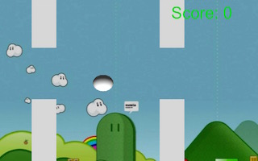
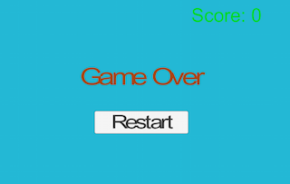
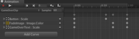

一直听别人说Unity怎么怎么，也看到好多unity3D开发的产品，但是也一直没有仔细去看过，前段时间刚好工作上要用unity3D开发一个Demo，就顺便学习了一下，Demo要的时间也很急，也是边做边学，做完回过头来看看，好多地方都不如意，比较乱，然后学习了一下官网的[教程](http://unity3d.com/learn/tutorials/projects/survival-shooter)，这个教程也基于Unity4.6版本的，添加了Unity自己的新UI模块，更便于制作UI。

为了练练手，就模仿Flapyp bird这款很火的游戏写了一个小作品，因为没有使用什么素材，除了背景从网上找了一张图片外其他都是Unity本来的东西，主角就使用了一个椭圆的球体来代替，看上去就像一个蛋，所以我称之为Flappy Egg，下面是游戏截图：

###障碍物

障碍物是由三部分组成，上下两部分的白色柱子，以及中间透明的可以让egg通过的区域，因为在整个屏幕中一次出现的障碍物最多只有三个，所以我就直接复制了三个放在场景中，当第一个移出屏幕左侧后重新设置位置到屏幕的右侧，高度是随机一个值，以确保可通过区域的高度有变化。下面是整个障碍物移动的代码：

	public Vector3 MinPosition;
	public Vector3 MaxPosition;

	public float Speed;

	void FixedUpdate()
	{
		Vector3 pos = transform.position;

		pos.x -= Speed * Time.deltaTime;

		if (pos.x < MinPosition.x) 
		{
			pos.x = MaxPosition.x;
			pos.z = Random.Range(MinPosition.z,MaxPosition.z);
		}

		transform.position = pos;
	} 
	

因为egg碰到障碍物就会触发游戏失败，因此障碍物的上下子部分都设置为Trigger Collider,具体代码如下：
	
	void OnTriggerEnter(Collider other) 
	{
		if (gameObject.name != "Boundary" && other.tag == "Bird") 
		{
			// Game Over
			print("Failed!");
			gc.GameOver();
		}
	}
	
当egg与障碍物一接触就触发游戏失败逻辑。

在上面的代码中出现了`gameObject.name != "Boundary"`，这是因为我把边界处理的代码也写到了同一个类中，整个游戏区域我用一个透明的立方体盒子包围起来，当egg离开这个盒子也就是离开屏幕范围也会导致游戏失败，因此代码如下：
	
	void OnTriggerExit(Collider other) 
	{
		if (gameObject.name == "Boundary" && other.tag == "Bird") 
		{
			gc.GameOver();		
		}
	}
	
当egg通过一个障碍物时会给玩家增加一定的得分，因此在障碍物的中间区域也是一个透明的Trigger Collider：

	void OnTriggerExit(Collider other) 
	{
		if (other.tag == "Bird") 
		{
			gc.Score(UnitScore);
		}
	}
	
### Egg
对于egg，只是简单的往下移动，当用户点击的时候会往上移动。
	
	public float Speed;
	void FixedUpdate()
	{
		if (Input.touchCount > 0)
		//if (Input.GetKey ("space")) 
		{
			rigidbody.velocity = transform.forward * Speed;
		} 
		else 
		{
			rigidbody.velocity = transform.forward * -Speed * 2;
		}

	}

### UI
游戏过程中只是简单的添加了一个得分label，游戏结束后会有一个带有动画的界面如图：

Game Over 以及 Restart 按钮会有一个从小到大再稍微缩小的动画，这个是通过自定义Animation来实现的。

整个实现过程还是很简单的，代码也没有多少，总的来说Unity3D已经做好了很多东西，简化了整个制作过程。

最后：整个源码在  [这里](https://github.com/guiyuan/Flappy-Egg.git)
